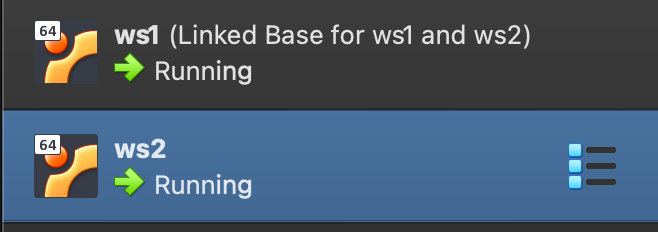
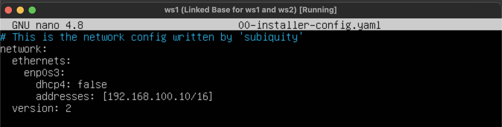
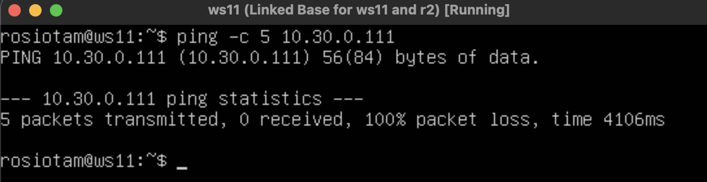
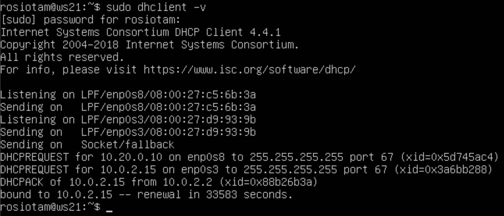

## Part 1. Инструмент **ipcalc**

### 1.1 Маски и сети

1) Адрес сети 192.167.38.54/13:

С помощью команды `ipcalc` 192.167.38.54/13 определяем адрес сети 192.160.0.0/13

2) Перевод маски:
- 255.255.255.0 в префиксную и двоичную запись:

- /15 в обычную и двоичную:

- 11111111.11111111.11111111.11110000 в обычную и префиксную:

* обычная форма записи *255.255.255.240*
* префиксная */28*

3) Минимальный и максимальный хост в сети 12.167.38.4 при масках: /8, 11111111.11111111.00000000.00000000, 255.255.254.0 и /4

### 1.2. localhost

- Определить и записать в отчёт, можно ли обратиться к приложению, работающему на localhost, со следующими IP: 194.34.23.100, 127.0.0.2, 127.1.0.1, 128.0.0.1

127.0.0.2, 127.1.0.1 - можем обратиться, т.к. диапазон 127.0.0.1 —127.255.255.254 - это стандартное, официально зарезервированное доменное имя для частных IP-адресов. Для сети, состоящей только из одного компьютера, как правило, используется всего один адрес — 127.0.0.1, который устанавливается на специальный сетевой интерфейс «внутренней петли» (англ. loopback) в сетевом протоколе TCP/IP.

194.34.23.100, 128.0.0.1 - не можем обратиться, т.к. находится за пределами хоста.

### 1.3. Диапазоны и сегменты сетей

#### 1.3.1. какие из перечисленных IP можно использовать в качестве публичного, а какие только в качестве частных: 10.0.0.45, 134.43.0.2, 192.168.4.2, 172.20.250.4, 172.0.2.1, 192.172.0.1, 172.68.0.2, 172.16.255.255, 10.10.10.10, 192.169.168.1

К частным адресам относятся IP-адреса, значения которых лежат в следующих диапазонах:
* 10.0.0.0 – 10.255.255.255 (10.0.0.0\8)
* 172.16.0.0 – 172.31.255.255 (172.16.0.0\12)
* 192.168.0.0 – 192.168.255.255 (192.168.0.0\16)

В качестве частных можем использовать:
* 10.0.0.45
* 10.10.10.10
* 172.20.250.4
* 172.16.255.255
* 192.168.4.2

В качестве публичных можем использовать:
* 134.43.0.2
* 172.0.2.1
* 172.68.0.2
* 192.172.0.1
* 192.169.168.1

#### 1.3.2. Какие из перечисленных IP адресов шлюза возможны у сети 10.10.0.0/18: 10.0.0.1, 10.10.0.2, 10.10.10.10, 10.10.100.1, 10.10.1.255

* Возможные IP адреса шлюза:
10.10.0.2, 10.10.10.10, 10.10.1.255, т.к. они входят в диапазон адресов сети

    Шлюз (Gateway) – это сетевое устройство, предназначенное для объединения двух сетей (передачи между ними пользовательского трафика), которые обладают различными характеристиками, используют различные протоколы или технологии.

## Part 2. Статическая маршрутизация между двумя машинами

Поднимем две виртуальные машины (далее -- ws1 и ws2)

С помощью команды `ip a` посмотрим существующие сетевые интерфейсы:

Вывод информации о сетевых интерфейсах с помощью команды `ip a` 

- Опишем сетевой интерфейс, соответствующий внутренней сети, на обеих машинах и зададим следующие адреса и маски: 
* ws1 - 192.168.100.10, маска /16,
* ws2 - 172.24.116.8, маска /12

Cодержание изменённого файла etc/netplan/00-installer-config.yaml для каждой машины:

Выполнить команду `netplan apply` для перезапуска сервиса сети:

Вызов и вывод после использованной команды `netplan apply`:

### 2.1. Добавление статического маршрута вручную

Добавим статический маршрут от одной машины до другой и обратно при помощи команды `ip r add`

Пропингуем соединение между машинами:

### 2.2. Добавление статического маршрута с сохранением

- Перезапустим машины:

- Добавим статический маршрут от одной машины до другой с помощью файла `etc/netplan/00-installer-config.yaml`

- Пингуем соединение между машинами:

## Part 3. Утилита **iperf3**

Скорость соединения проверяем с помощью утилиты iperf3:

Добавляем еще один сетевой адаптер в настройках виртуальных машин ws1 и ws2 для доступа в интернет, настраиваем его в файле `etc/netplan/00-installer-config.yaml`

### 3.1. Скорость соединения

Разница между байтами в секунду (Б/с) и битами в секунду такая же, как разница между байтами и битами: 1 Б/с = 8 бит/с.

Точно так же разница между килобайтами в секунду (КБ/с) и Б/с такая же, как разница между килобайтами и байтами: 1 КБ/с = 1024 Б/с. И так далее.

Переведем 8 Mbps в MB/s, 100 MB/s в Kbps, 1 Gbps в Mbps:

    * 8 Mbps -> 1 MB/s
    * 100 MB/s -> 800000 Kbps
    * 1 Gbps -> 1024 Mbps

### 3.2. Утилита iperf3

Измерим скорость соединения между ws1 и ws2:

## Part 4. Сетевой экран

### 4.1. Утилита iptables

Создадим файл `/etc/firewall.sh`, имитирующий фаерволл, на ws1 и ws2:

Добавим в файл подряд следующие правила:

1) на ws1 применим стратегию, когда в начале пишется запрещающее правило, а в конце пишется разрешающее правило (это касается пунктов 4 и 5)
2) на ws2 применим стратегию, когда в начале пишется разрешающее правило, а в конце пишется запрещающее правило (это касается пунктов 4 и 5)
3) откроем на машинах доступ для порта 22 (ssh) и порта 80 (http)
4) запретим echo reply (машина не должна "пинговаться”, т.е. должна быть блокировка на OUTPUT)
5) разрешить echo reply (машина должна "пинговаться")

Запустим файлы на обеих машинах командами `chmod +x /etc/firewall.sh` и `/etc/firewall.sh`

Разница между стратегиями -  выполняется первое подходящее правило. Правила, которые применяются после, будут игнорироваться.

#### 4.2. Утилита nmap

Командой ping найдем машину, которая не "пингуется", после чего утилитой `nmap` покажем, что хост машины запущен

Проверка: в выводе nmap должно быть сказано: `Host is up`

Сохраним дампы образов виртуальных машин:

## Part 5. Статическая маршрутизация сети

Создаем пять виртуальных машин (3 рабочие станции (ws11, ws21, ws22) и 2 роутера (r1, r2)):

### 5.1. Настройка адресов машин:

Настроиваем конфигурации машин в `etc/netplan/00-installer-config.yaml` согласно сети на рисунке

Перезапускаем сервис сети. Командой `ip -4 a` проверяем, что адреса машин задан верно:

Также пропингуем ws22 с ws21 и r1 с ws11:

### 5.2. Включение переадресации IP-адресов

Для включения переадресации IP, выполним команду на роутерах:

`sysctl -w net.ipv4.ip_forward=1`

При таком подходе переадресация не будет работать после перезагрузки системы.

Откроем файл `/etc/sysctl.conf` и раскомментируем нужную строку. 

При таком подходе переадресация будет включена на постоянной основе:

### 5.3. Установка маршрута по-умолчанию

Настроиваем маршрут по-умолчанию (шлюз) для рабочих станций. Для этого добавляем `default` перед IP роутера в файле конфигураций

`etc/netplan/00-installer-config.yaml`

После изменений применяем команду `sudo netplan apply` для вступления в силу изменений

С помощью команды `ip r` убедимся, что маршрут добавился в таблицу маршрутизации

Пропингуем с ws11 роутер r2, пинг не пройдёт, т.к. роутер "не знает" куда вернуть ответ, при этом передача пакетов с машины осуществляется.

Запускаем на r2 утилиту `tcpdump`, которая позволяет прослушать порты и вывести на экран информацию с каких IP адресов приходят пакеты. В данном случае слушаем интерфейс enp0s8

### 5.4. Добавление статических маршрутов

Добавим в роутеры r1 и r2 статические маршруты в файле конфигураций

`etc/netplan/00-installer-config.yaml`

Для применения изменений используем команду `sudo netplan apply`

Вызовем `ip r` и посмотрим таблицы с маршрутами на обоих роутерах:

10.20.0.0/26 через 10.100.0.12 устройство enp0s9

10.10.0.0/18 через 10.100.0.11 устройство enp0s8

Запустим команды на ws11:
- `ip r list 10.10.0.0/18`
- `ip r list 0.0.0.0/0`

Для адреса 10.10.0.0/18 был выбран маршрут, отличный от 0.0.0.0/0 (он попадает под маршрут по-умолчанию), т.к. машина ws11 соединена с сетью 10.10.0.0/18 по своему IP-адресу 10.10.0.2, для других адресов используется маршрут по умолчанию, который указан в файле 10.10.0.1.

### 5.5. Построение списка маршрутизаторов

Запустим на r1 команду дампа:

`tcpdump -tnv -i enp0s8`
- `-n` - не конвертировать адреса в имена;
- `-t` - не выводить время при выводе каждой строчки дампа;
- `-v` - выводить более подробную информацию. Например, печатаются время создания, общая длина и параметры IP-пакета. Также включает дополнительные проверки целостности пакетов, такие как проверка контрольной суммы заголовка IP и ICMP.

При помощи утилиты `traceroute` построим список маршрутизаторов на пути от ws11 до ws21:

Каждый пакет проходит на своем пути определенное количество узлов, пока достигнет своей цели. Причем, каждый пакет имеет свое время жизни. Это количество узлов, которые может пройти пакет перед тем, как он будет уничтожен. Этот параметр записывается в заголовке TTL, каждый маршрутизатор, через который будет проходить пакет уменьшает его на единицу. При TTL=0 пакет уничтожается, а отправителю отсылается сообщение Time Exceeded.

Команда traceroute linux использует UDP пакеты. Она отправляет пакет с TTL=1 и смотрит адрес ответившего узла, дальше TTL=2, TTL=3 и так пока не достигнет цели. Каждый раз отправляется по три пакета и для каждого из них измеряется время прохождения. Пакет отправляется на случайный порт, который, скорее всего, не занят. Когда утилита traceroute получает сообщение от целевого узла о том, что порт недоступен трассировка считается завершенной.

###  5.6. Использование протокола ICMP при маршрутизации

Запустить на r1 перехват сетевого трафика, проходящего через `enp0s8` с помощью команды:

`sudo tcpdump -n -i enp0s8 icmp`

Пропингуем с ws11 несуществующий IP (например, 10.30.0.111) с помощью команды:
ping -c 5 10.30.0.111

Сохраняем дампы образов виртуальных машин

## Part 6. Динамическая настройка IP с помощью **DHCP**

Для r2 настроим в файле `/etc/dhcp/dhcpd.conf` конфигурацию службы DHCP:

1) укажем адрес маршрутизатора по-умолчанию, DNS-сервер и адрес внутренней сети:

2) в файле resolv.conf пропишем `nameserver 8.8.8.8`

Содержит адреса серверов имен, к которым имеет доступ данная система

Перезагрузим службу DHCP командой `systemctl restart isc-dhcp-server`

Машину ws21 перезагрузим при помощи `reboot` и через `ip a` посмотрим, что она получила адрес. Также пропингуем ws22 с ws21.

Изменим настройки машин ws21 и ws22 в файле конфигурации, чтобы сделать протокол DHCP активным.

`sudo nano /etc/netplan/
00-installer-config.yaml`

`sudo netplan apply`

Перезагружаем виртуальную машину ws21

`sudo systemctl reboot`

Проверяем присвоенный устройствам адрес командой `ip a`

Пробуем пропинговать ws22 с ws21:

Укажем MAC адрес у ws11, для этого в  `etc/netplan/00-installer-config.yaml` надо добавить строки: `macaddress: 10:10:10:10:10:BA`, `dhcp4: true`

Теперь необходимо выключить машину ws11 и в менеджере виртуальных машин VirtualBox также изменить macaddress:

Для r1 настроим аналогично r2, но сделаем выдачу адресов с жесткой привязкой к MAC-адресу (ws11)

Отредактируем файл
`sudo nano /etc/dhcp/dhcpd.conf`

Отредактируем файл 
`sudo nano /etc/resolv.conf`

Перезапустим `systemctl restart isc-dhcp-server`

Проводим аналогичные тесты - проверяем какой адрес назначен машине ws11

Пропингуем ws21 c ws22

Запросим с ws21 обновление ip адреса

Обновление ip адреса производится с помощью команды `sudo dhclient`

Посмотрим IP до обновления

Запросим с ws21 обновление ip адреса с помощью команды `sudo dhclient -v`

- `v` - будет выведена дополнительная информация

Проверяем измения командой `ip a`

В части 6 были использованы следующие опции `DHCP` протокола:

`option routers ip-address [, ip-address...];` - адреса шлюзов для клиентской сети. Маршрутизаторы должны быть перечислены в порядке предпочтительности.

`option domain-name-servers ip-address [, ip-address...];` - Список DNS серверов доступных клиенту. Сервера должны быть перечислены в порядке предпочтительности.

Сохраняем дампы образов виртуальных машин

## Part 7. **NAT**

Для работы с сервером `apache2`, установим его на машины r1, r2 и ws22 следующей командой

`sudo apt install apache2`

В файле `/etc/apache2/ports.conf` на ws22 и r1 изменим строку `Listen 80` на `Listen 0.0.0.0:80`, то есть сделаем сервер Apache2 общедоступным

Запустим веб-сервер Apache командой service `apache2 start` на ws22 и r1

Статус можно проверить командой 
`sudo systemctl status apache2`

Добавим в фаервол, созданный по аналогии с фаерволом из Части 4, на r2 следующие правила:

1) Удаление правил в таблице filter - `iptables -F`
2) Удаление правил в таблице "NAT" - `iptables -F -t nat`
3) Отбрасывать все маршрутизируемые пакеты - `iptables --policy FORWARD DROP`

При запуске файла `firewall.sh` с этими правилами, ws22 не должна "пинговаться" с r1.

Проверим соединение между r1 и ws22

Проверим соединение между r1 и ws22

Добавим в файл ещё одно правило:

- Разрешить маршрутизацию всех пакетов протокола ICMP, для этого прописываем правило для протокола icmp и цепочки FORWARD

`sudo nano /etc/apache2/ports.conf`

Проверим соединение между ws22 и r1 командой `ping`

При запуске файла `firewall.sh` с этими правилами, ws22 должна "пинговаться" с r1

Добавим в файл ещё два правила:

5) Включаем `SNAT`, а именно маскирование всех локальных ip из локальной сети, находящейся за r2 (по обозначениям из Части 5 - сеть 10.20.0.0)

6) Включаем `DNAT` на 8080 порт машины r2 и добавляем к веб-серверу Apache, запущенному на ws22, доступ извне сети

Значения использованных опций:

- t - указывает на используемую таблицу;
- p - указывает протокол, такие как tcp, udp, udplite и другие, поддерживаемые системой, ознакомиться со списком можно в файле /etc/protocols;
- s - указывает адрес источника пакета, в качестве значения можно указать как один IP-адрес, так и диапазон;
- --dport - порт получателя пакета;

`DNAT` — подменяет адрес получателя в заголовке IP-пакета, основное применение — предоставление доступа к сервисам снаружи, находящимся внутри сети;

`SNAT` — служит для преобразования сетевых адресов, применимо, когда за сервером находятся машины, которым необходимо предоставить доступ в Интернет, при этом от провайдера имеется статический IP-адрес

Проверяем соединение по TCP для `SNAT`, для этого с ws22 подключаемся к серверу Apache на r1 командой `telnet [адрес] [порт]`

Проверим соединение по TCP для `DNAT`, для этого с r1 подключимся к серверу Apache на ws22 командой `telnet` (обращаться по адресу r2 и порту 8080)

Сохраняем дампы образов виртуальных машин

## Part 8. Дополнительно. Знакомство с **SSH Tunnels**

Запустим на r2 фаервол с правилами из Части 7

Запустим веб-сервер Apache на ws22 только на `localhost` (то есть в файле `/etc/apache2/ports.conf` изменим строку `Listen 80` на `Listen localhost:80`)

Воспользуемся `Local TCP forwarding` с ws21 до ws22, чтобы получить доступ к веб-серверу на ws22 с ws21

Переадресация локального порта позволяет перенаправить порт на локальном компьютере (клиент ssh) на порт на удаленном компьютере (сервер ssh), который затем перенаправляется на порт на компьютере назначения. В этом типе переадресации клиент SSH прослушивает заданный порт и туннелирует любое подключение к этому порту к указанному порту на удаленном сервере SSH, который затем подключается к порту на целевом компьютере. Конечным компьютером может быть удаленный SSH-сервер или любой другой компьютер.

Устанавливаем соединение с сервером ws22 от машины ws21

`ssh -L 8080:localhost:80 10.20.0.20`

Воспользуемся `Remote TCP forwarding` c ws11 до ws22, чтобы получить доступ к веб-серверу на ws22 с ws11

Переадресация удаленного порта противоположна переадресации локального порта. Это позволяет перенаправить порт на удалённом компьютере (сервер ssh) на порт на локальном компьютере (клиент ssh), который затем перенаправляется на порт на компьютере назначения. В этом типе переадресации сервер SSH прослушивает заданный порт и туннелирует любое соединение с этим портом на указанный порт локального клиента SSH, который затем подключается к порту на целевом компьютере. Машина назначения может быть локальной или любой другой машиной. Удаленное перенаправление портов в основном используется для предоставления доступа к внутренней службе кому-то извне.

Для проверки, сработало ли подключение в обоих предыдущих пунктах, перейдите во второй терминал (например, клавишами Alt + F2) и выполните команду:
`telnet 127.0.0.1 [локальный порт]`

ws11:

ws21:

Сохраняем дампы образов виртуальных машин

